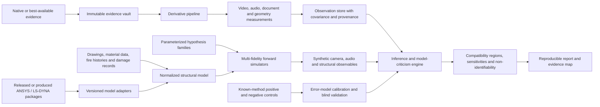

# CRW system blueprint

## 1. Objective

The Collapse Reconstruction Workbench will compare observed collapse evidence with predictions generated by explicit physical scenarios. It must support both released evidence and later-produced model packages without changing the rules after seeing which hypothesis benefits.

CRW answers five questions:

1. What was actually observed, and with what uncertainty?
2. What hidden mechanisms are physically capable of generating those observations?
3. Which assumptions or parameters control each result?
4. Which competing mechanisms remain indistinguishable?
5. What missing evidence would most reduce that uncertainty?

## 2. Non-goals

CRW will not:

- infer motive, identity, authorization, or conspiracy;
- declare causation from visual resemblance;
- train only on demolition videos;
- convert digital amplitude into physical sound-pressure level without calibration;
- assign posterior odds while hiding or improvising priors;
- treat a simulation animation as a measurement;
- treat absence of evidence in an obstructed or edited recording as proof of absence;
- fill missing interior observations with generative imagery; or
- collapse model uncertainty into a single undocumented confidence score.

## 3. System architecture



The evidence and observation layers must function without a finite-element solver. The inference layer consumes explicit observations rather than unrestricted narrative text.

## 4. Architectural layers

### 4.1 Evidence vault

Responsibilities:

- ingest exact acquired bytes without transcoding;
- calculate SHA-256 and byte count during ingestion;
- record source page, acquisition route, acquisition time, ownership and asserted capture time separately;
- preserve platform metadata and custody claims without treating them as verified facts;
- assign immutable evidence identifiers;
- prohibit overwrite; and
- link every derivative to all parent objects.

The minimum viable implementation can use a content-addressed filesystem plus SQLite. A larger deployment can substitute object storage and PostgreSQL while preserving the same identifiers and contracts.

### 4.2 Derivative pipeline

Every transformation becomes a recorded node in a provenance graph. Examples include:

- audio extraction;
- deinterlacing;
- constant-frame-rate proxy creation;
- lossless frame extraction;
- lens correction;
- stabilization;
- transcription;
- spectrogram generation;
- masks and optical-flow fields; and
- simulation renderings.

Each derivative records parent hash, tool version, command/configuration, operator, time, and output hash. Analysis tools may read sources but never modify them.

### 4.3 Media measurement services

#### Video service

- Construct a source-frame timestamp table from container timestamps rather than assuming nominal frame rate.
- Detect interlacing, duplicated frames, dropped frames, edits, resampling, and camera shake.
- Calibrate lens distortion and camera pose from surveyed or independently modeled fixed geometry.
- Track multiple building points and line features with per-frame covariance.
- Segment façade, skyline, dust, smoke, and foreground occlusion.
- Estimate displacement, velocity, acceleration, rotation, shear, curvature, and coherence only where supported by pixels.
- Retain manual corrections and model-generated suggestions as separate annotations.

Acceleration is derived only after publishing raw image coordinates, calibration, filtering choices, residuals, and sensitivity to smoothing.

#### Audio service

- Preserve and analyze native channels separately before any mono mix.
- Detect edits, discontinuities, clipping, compression, automatic gain behavior, and channel disagreement.
- Produce candidate transient events without causal labels.
- Estimate source-time intervals from camera location, candidate source region, atmospheric range, and propagation uncertainty.
- Compare duration, bandwidth, impulse spacing, reverberation, and cross-recording agreement.
- Reject physical-SPL claims unless calibration and gain history support them.

Speech transcription is a navigation layer. It is not a substitute for waveform analysis or speaker authentication.

#### Document and model service

- Extract citable propositions from reports while retaining page and figure coordinates.
- Parse drawings and schedules into a normalized member/connection graph.
- Import material curves, fire histories, damage states, load cases, and solver controls.
- Keep agency claims, challenger claims, measurements, and model assumptions as different object types.

### 4.4 Observation store

An observation is a measured quantity, interval, categorical feature, or documented absence with:

- source evidence IDs;
- coordinate and time reference;
- extraction method and code version;
- value or series location;
- measurement uncertainty;
- synchronization uncertainty;
- calibration uncertainty;
- occlusion/completeness status;
- reviewer status; and
- known confounders.

Examples include “north roof point displaced 32 m during interval X,” “east edge rotated north,” “candidate audio transient arrived during interval Y,” and “lower façade not visible.”

### 4.5 Normalized structural model

The structural representation is a graph with versioned layers:

1. geometry and topology;
2. member and connection properties;
3. gravity and service loads;
4. fire/temperature histories;
5. observed or assumed initial damage;
6. constitutive and failure models; and
7. solver-specific realization.

The normalized graph is not a replacement for the original solver model. It enables cross-model comparison and exposes assumptions that otherwise remain buried in proprietary files.

### 4.6 Model adapters

An adapter must import, fingerprint, and—where licensing permits—execute a model package without silently translating it. Initial targets are:

- ANSYS structural/thermal input and result packages;
- LS-DYNA keyword decks, include trees, material/contact cards, and result databases;
- fire-to-thermal and thermal-to-structural transfer scripts;
- model-damage handoff files; and
- open reference models for reduced-order testing.

Every adapter reports unsupported cards, missing includes, version-dependent defaults, unit assumptions, custom routines, and binary objects it cannot inspect. A partially imported model must never be labeled reproduced.

#### WTC 7 ingestion map

| Input class | Current/released use | Additional value if complete executable files are produced |
|---|---|---|
| Native or best-available camera files | Frame timing, camera calibration, point/line tracks, edits and occlusion | Higher generation and complete lead-in reduce measurement and timing uncertainty |
| Native audio channels | Candidate transients, speech, edit detection and cross-camera timing | Microphone metadata and continuous tracks permit propagation-corrected agreement tests |
| Reports, FAQs and journal paper | Extract declared geometry, assumptions, sequence and validation claims | Remain the human-readable map against which model behavior is checked |
| Drawings and connection schedules | Build normalized structural topology and camera-aligned geometry | Complete revisions and shop details reduce connection and load-path ambiguity |
| Fire and thermal data | Constrain heat-release and temperature histories where published | Meshes, boundary conditions and transfer fields permit exact thermal reruns |
| ANSYS package | Reconstruct the 16-story response stage only from published descriptions | Inputs, results and custom routines permit baseline execution and sensitivity analysis |
| LS-DYNA package | Evaluate declared global-collapse logic from report descriptions | Keyword/include tree, damage state and result database permit end-to-end reproduction |
| Handoff scripts/files | Presently infer transfer assumptions from narrative | Directly test timing, instantaneous element removal and alternative transfer procedures |
| Full result histories | Compare selected published frames and tables | Evaluate energy, contact, column histories, failure ordering and unselected outputs |

The produced model package enters through the evidence vault first. Analysts do not repair, translate, or execute it until its dependency graph and hashes are frozen.

### 4.7 Hypothesis families

Hypotheses are parameterized mechanism families, not narrative labels:

- **FIRE_PROGRESSIVE:** thermal expansion, connection/floor failures, loss of lateral restraint, load redistribution, and column instability;
- **DAMAGE_PROGRESSIVE:** initial impact/debris damage followed by gravity-driven redistribution;
- **EXPLOSIVE_SUPPORT_REMOVAL:** timed loss of specified member capacity plus blast/acoustic predictions;
- **NONEXPLOSIVE_INDUCED:** cuts, pulls, jacks, or prescribed support release without explosive impulse;
- **HYBRID:** explicitly declared combinations; and
- **NULL_OR_OTHER:** models used to expose that the tested families do not span the observations.

Each family must declare its parameters, physical constraints, predicted auxiliary evidence, and falsification opportunities. “Remove all columns” is a sufficiency experiment, not a causal mechanism unless a physical removal process is also modeled.

### 4.8 Multi-fidelity forward simulation

Use three fidelity levels:

| Level | Model | Purpose |
|---|---|---|
| L0 | Kinematic/support-loss model | Rapid feasibility bounds and camera/render tests |
| L1 | Reduced structural graph or subassembly models | Screen connection, restraint, buckling, and propagation parameters |
| L2 | Full nonlinear finite-element model | Test surviving parameter regions and reproduce supplied models |

The system should not begin with thousands of full-collapse finite-element runs. L0 and L1 eliminate physically impossible regions; emulators trained on verified runs can then guide expensive L2 sampling.

### 4.9 Synthetic sensors

Every simulation must be translated into the quantities actually observed:

- render geometry from each real camera pose;
- apply visibility and occlusion masks;
- sample at source frame timestamps;
- predict the same tracked points and line features;
- generate source-event times for acoustic propagation; and
- report observables before comparing them with evidence.

Comparing an internal model node directly with an uncalibrated image coordinate is prohibited.

### 4.10 Inference and model criticism

For hypothesis family *H*, parameters \(\theta\), observations \(y\), and model-discrepancy term \(\delta\):

\[
p(\theta,H\mid y) \propto p(y\mid\theta,H,\delta)\,p(\theta\mid H)\,p(H).
\]

CRW must expose all three elements separately:

- **likelihood/compatibility:** how well predicted observables match measurements;
- **within-family parameter assumptions:** permissible temperatures, strengths, damage and timing; and
- **between-family priors:** any prior weighting of causal families.

Because collapse simulations contain discontinuities, contact, buckling, element deletion, and solver failure, the first inference engine should support likelihood-free methods such as approximate Bayesian computation, history matching, and simulation-based inference. A scalar best-fit score is insufficient.

The observation likelihood should include correlated error and an explicit model-discrepancy allowance. Otherwise the largest data stream or an unrealistically precise track will dominate every other observation.

### 4.11 Comparator library

The comparator corpus must include:

- confirmed explosive demolitions;
- confirmed nonexplosive induced collapses;
- accidental fire-progressive collapses;
- impact, earthquake, construction-stage, and partial collapses;
- non-collapse fires and damaged structures; and
- urban acoustic negative controls.

Each event receives one immutable event ID. All clips from an event remain in the same train, calibration, or holdout partition. Method labels require project records, engineering documentation, responsible-party confirmation, or equivalent independent foundation.

The corpus is used to calibrate error models, test feature specificity, and validate measurement tools—not to learn a black-box causal verdict.

## 5. AI boundary

### Permitted uses

- source deduplication suggestions;
- scene segmentation and feature proposals;
- point/line tracking with uncertainty;
- edit and anomaly detection;
- transcript/search assistance;
- simulation emulation and parameter proposal;
- clustering residual patterns; and
- prioritizing records likely to reduce uncertainty.

### Prohibited uses

- hallucinating obscured structural behavior;
- using generated frames as observations;
- converting witness language directly into mechanism labels;
- allowing model-generated annotations to overwrite human measurements;
- training and testing on different clips of the same event; and
- issuing an unexplained probability of demolition or fire.

All AI outputs are suggestions or derived measurements with model identity, version, configuration, and review status.

### Learning strategy

Use separate models for separate epistemic tasks:

1. **Perception models** propose tracks, masks, edits and acoustic events. They train on labeled features, not causal event labels, and must expose confidence/calibration on held-out events.
2. **Representation models** may learn from unlabeled structural and demolition footage, but downstream measurements are checked against synthetic ground truth and human annotations.
3. **Simulation emulators** approximate verified forward-solver outputs over a declared parameter domain. They may accelerate search but cannot extrapolate silently or replace final high-fidelity confirmation.

Synthetic data should vary camera angle, focal length, compression, frame rate, lighting, smoke/dust, occlusion, microphone response and structural parameters. This domain randomization tests robustness; it does not make synthetic footage evidence. WTC 7 has no causal training label and is never used to report a conventional classifier's “accuracy.”

## 6. Service boundaries and interfaces

The first implementation should be a local-first Python command-line system with stable JSON contracts:

```text
crw ingest       evidence files and acquisition metadata
crw derive       registered media/document derivatives
crw calibrate    cameras, clocks and audio propagation
crw measure      tracks, events and uncertainty objects
crw model import structural and thermal packages
crw simulate     parameterized scenario runs
crw compare      predicted versus observed quantities
crw validate     holdouts, ablations and reproducibility gates
crw report       evidence maps and model-criticism reports
```

Suggested module boundaries:

```text
crw/
  evidence/       hashing, custody, metadata and provenance DAG
  media/          video/audio decoding and derivative registration
  calibration/    camera, clock and propagation models
  observations/   measurement contracts and review workflow
  structures/     normalized building graph and units
  adapters/       ANSYS, LS-DYNA and reference-model adapters
  simulation/     execution, scheduling and result fingerprinting
  inference/      likelihoods, emulators, sampling and sensitivity
  validation/     controls, holdouts, ablations and error rates
  reporting/      reproducible technical outputs
```

SQLite, Parquet, and a content-addressed filesystem are sufficient for the pilot. Database and object-storage substitutions should wait until concurrent users or remote compute require them.

### Reference implementation choices

| Concern | Pilot choice | Reason |
|---|---|---|
| Analysis and orchestration | Python package and CLI | Strong scientific, media and inference ecosystem; easy batch reproduction |
| Metadata and review state | SQLite | Transactional, portable and sufficient for a local pilot |
| Dense numeric series | Parquet/Arrow files referenced by immutable IDs | Efficient columnar storage without inflating JSON objects |
| Source/derivative bytes | Content-addressed filesystem | Simple integrity and deduplication model |
| Media decoding | FFmpeg/ffprobe subprocess boundary | Preserves native timestamps and supports broad legacy formats |
| Vision/math | OpenCV plus NumPy/SciPy-class libraries | Transparent baseline algorithms before learned models |
| Contracts | JSON Schema 2020-12 | Language-neutral validation and stable exchange |
| Configuration | Versioned JSON or YAML resolved to canonical JSON | Human authoring with deterministic run records |
| Testing | Unit, property, fixture and golden-output tests | Separates code correctness from scientific validation |
| Heavy solvers | Isolated adapter workers | Protects the evidence core from proprietary/version-specific execution |
| User interface | Structured files and generated reports first | Avoids building a dashboard before the analytical contracts stabilize |

The first interface should be the CLI plus static reports. A review UI becomes justified when independent analysts need concurrent annotation and adjudication.

## 7. Reproducibility and execution

Every run record includes:

- source and model hashes;
- repository commit;
- container/environment digest;
- solver name, build, license mode, precision, and platform;
- complete parameter set and unit system;
- random seed or deterministic declaration;
- wall time and hardware class;
- stdout/stderr and solver termination state;
- output hashes; and
- comparison-code version.

A simulation that crashes, exhibits nonphysical energy growth, excessive penetration, mesh pathology, or undocumented mass loss remains in the registry with a failed-quality status.

## 8. Security and trust boundaries

- Treat imported archives, model includes, macros, and scripts as untrusted.
- Parse before execution and run third-party model packages in isolated environments.
- Never expose expired signed media URLs or embedded credentials in public reports.
- Separate evidence-custodian permissions from analyst annotations.
- Append custody and transformation events; do not edit history in place.
- Keep proprietary solver materials and redistribution rights distinct from evidentiary relevance.

## 9. Governance and decision rights

- **Evidence custodian:** may ingest and verify bytes but cannot silently change analytical metadata.
- **Measurement analyst:** may create observations but cannot change scenario definitions after unblinding.
- **Scenario author:** may define physical parameter families but cannot alter accepted observations.
- **Reviewer:** adjudicates disputed measurements without seeing scenario fit where feasible.
- **Release manager:** builds a reproduction bundle from frozen hashes and configurations.

Material protocol changes require a new protocol version, a rationale, and rerunning all affected hypotheses. Results under the old protocol remain accessible.

## 10. Required outputs

CRW produces:

1. an evidence/provenance graph;
2. camera and clock calibration reports;
3. raw measurement series and uncertainty decompositions;
4. a synchronized event timeline;
5. scenario parameter regions that survive each observation;
6. residual plots by camera, feature and time;
7. global sensitivity and identifiability reports;
8. model-discrepancy and failed-run inventories;
9. an evidence-value analysis identifying the next most useful record; and
10. a fully regenerable technical report.

The report must say “not distinguishable with present evidence” when that is the result.
